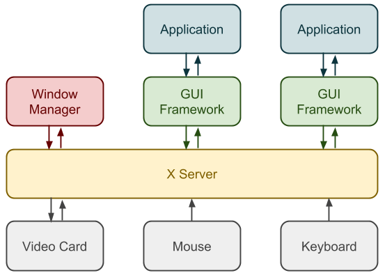
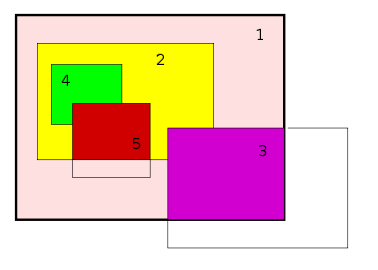

# zwm
A window manager so I understand what the hell x-server is doing.

## X-Server in a really big nutshell...
A list of important concepts of X-Server is that it is built to be as low-level as possible. The X-Server communicates 
in a server-client model. A window manager is just a client communicating with the X-Server. 

This image shows the x-server's relationship to input devices and window manager.

#### Window Heirarchy (Hierarchy of Rectangles)

1. The root window container: This is the main window, the area in which everything created related to it can be dispalyed
2. A top level window: Windows created inside the root container. They can have child windows. In this case, 4 and 5 are child windows of 2. Child window 5 looks like it is being cropped out of window 2. A window is clipped to its parents boundarys. No actions can be completed or requested on the area that is cropped.
3. Another top level window, in this case also displaying as cropped. Window 3 is a child of the root window and therefore will still only display within the boundarys of its parent 1. 

#### Substructure Redirection
Basically, how x-server mainly functions is an application will send a request to x-server, and thats the end. The window manager has to get these requests though. Substructure Redirection is what does this. The window manager will need to know that a new top level window has been created and needs to create all the decorations (minimize, maximize and close buttons). A request can be made by an application, x-server will process it then send it to the window manager which can do whatever it wants with the request.

#### Reparenting
When you seen all the minimize buttons, maximize buttons and frames around a window, this is created by the Window Manager. 

### References
- [Chuan Ji's Blog](https://jichu4n.com/posts/how-x-window-managers-work-and-how-to-write-one-part-i/)
- [Xlib Docs](https://tronche.com/gui/x/xlib/)
- [X11 R7.7 Docs](https://www.x.org/releases/X11R7.7/doc/)
- [Wikipeadia](https://en.wikipedia.org/wiki/Root_window)