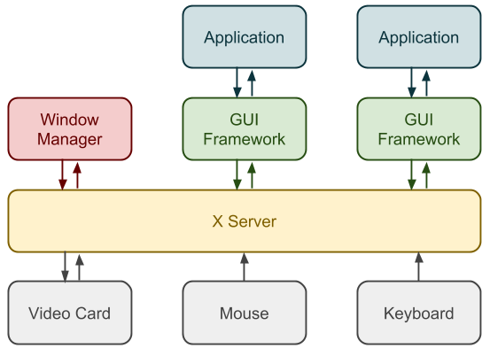

# zwm
A window manager so I understand what the hell x-server is doing.

### My Understanding of X
A list of important concepts of X-Server is that it is built to be as low-level as possible. The X-Server communicates 
in a server-client model. A window manager is just a client communicating with the X-Server. 

This image shows the typical server-client relationship.

### References
- [Chuan Ji's Blog](https://jichu4n.com/posts/how-x-window-managers-work-and-how-to-write-one-part-i/)
- [Xlib Docs](https://tronche.com/gui/x/xlib/)
- [X11 R7.7 Docs](https://www.x.org/releases/X11R7.7/doc/)